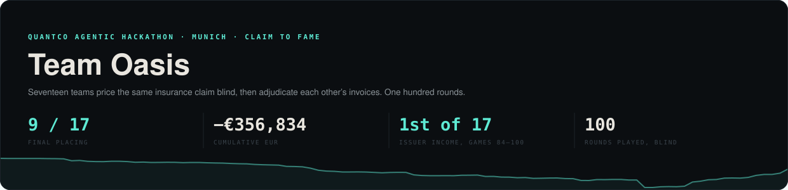
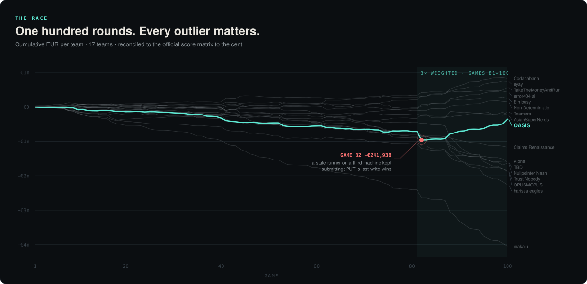
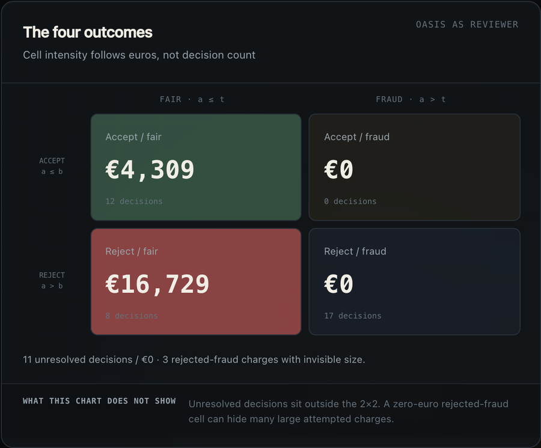
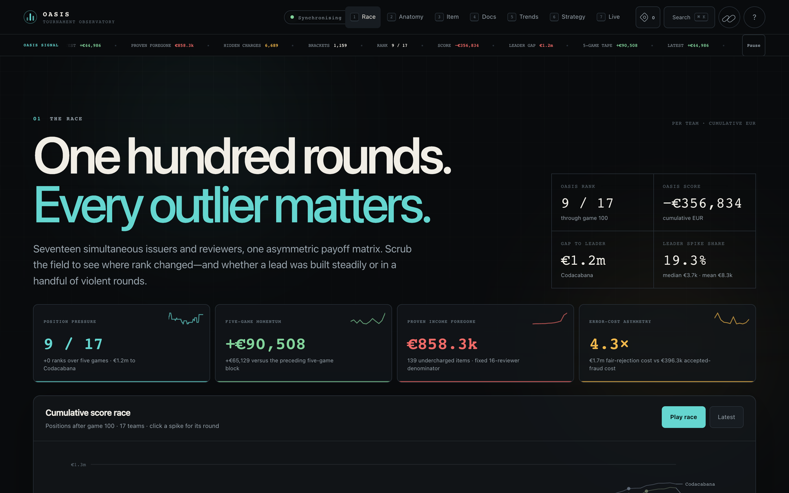
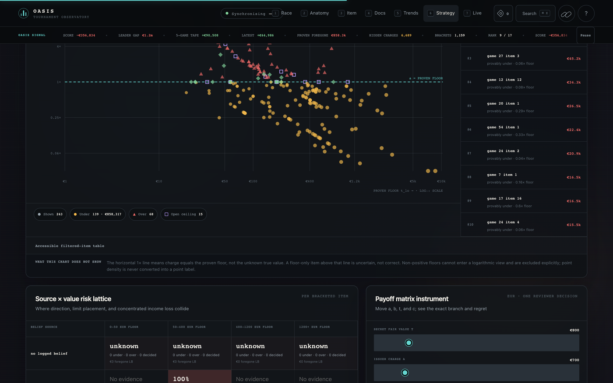
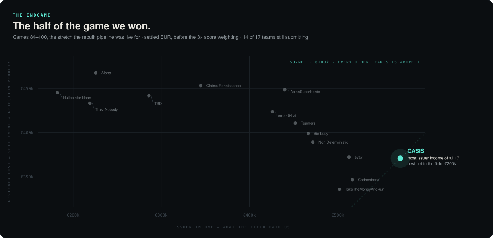

<div align="center">



<br>

     

**[The write-up →](docs/SUBMISSION.md)** · [How the game works](docs/MODEL_BRIEF.md) · [The observatory](viz/README.md) · [Findings, including the dead ends](analysis/)

</div>

---

Seventeen teams get the same insurance claim: a policy, a damage description, a photo, and
an invoice with the prices cut out. Every line item has a secret fair value `t`. Blind, you
submit **`a`** — what you charge all sixteen opponents as the handyman — and **`b`** — the
limit up to which you accept *their* charges as the insurer. Then you do it again, 99 more
times, one round every 12 minutes and 38 seconds, for twenty-six hours.

This repository is everything Team Oasis built to play it, plus an honest account of the
half we won and the half we lost.



## The whole game is one asymmetry



A **fair** charge (`a ≤ t`) is paid by *every* opponent — including the ones who reject it,
because rejecting still owes you `a` plus a `0.5a` penalty. Charge above `t` and you collect
only from the minority who accept anyway.

So overbidding is nearly free and **undercharging is a silent, total loss of a guaranteed
16×**. Acceptance rate is a vanity metric.

On the other side, accepting a fraudulent charge costs `a`; rejecting a fair one costs
`1.5a`. Accept only when `P(fair) > 2/3`.

Both halves run off the same belief about `t`, which is why an estimate that is too low
makes you undercharge **and** over-reject at the same time. Everything else in this repo is
downstream of that one number.

<br clear="right">

## What is in here

| Path | What it is |
| --- | --- |
| **[`viz/`](viz/README.md)** | **The Tournament Observatory.** 13k lines of dependency-free frontend over a read-only data layer: the 100-round race, per-item capital-flow tomography, a 17×17 market-microstructure ledger, a round replay theatre, and a belief-calibration studio. Local-only, read-only, claim-free by construction. |
| [`pipeline/`](pipeline/) | **The runner that played games 44–100.** Luis Dehlwes's v2 system with its full history: data foundation, retrieval anchors, per-case policy digest, value-dependent acceptance limits, 3-model text-only ensemble. |
| `c2f/`, `tools/`, `rules_user/` | The v1 system that played games 1–43, plus the measurement tooling we never stopped using — a euro scorer that self-validates against realised scores, per-config backtests, proven-threshold derivation. |
| [`analysis/`](analysis/) | Findings as they were made, `author-time-topic.md`. Includes the negative results: ten reviewer-side candidates measured and killed, each with its number. |
| [`docs/`](docs/) | The write-up, the payoff-matrix brief, the runbook. |

## The observatory

Every number we acted on came from here. It reads the harvester database through SQLite's
read-only URI mode, tails the append-only event log, and decrypts case documents only into
a gitignored scratch directory — the server has no HTTP client and literally no `submit`
method, enforced by a test.





The landscape above is the finding that reframed our whole second half: **139 items were
provably charged under their floor, for €858,317 of income we simply never asked for.** No
error surfaced anywhere, because undercharging never does.

```bash
PYTHONPATH=. python3 -m viz.server --check     # validate the data layer, exit
PYTHONPATH=. python3 -m viz.server             # http://127.0.0.1:8090
```

It refuses a non-loopback bind without an explicit flag, and degrades loudly — the banner in
that screenshot is the app telling you its local recorder is behind the tournament, rather
than drawing a confident chart over a gap.

## The half we won



Games 1–43 lost roughly €328k to LLM point estimates, boolean coverage decisions, and no
validation layer. We rebuilt around a data foundation instead of a model, and over games
84–100 — at triple weight, with the corrected package live — **we took the most issuer
income in the field and the best net of all seventeen.** Thirteen of the last fourteen
rounds were positive, +€575,513, and we won the finale outright by €31,998.

It came too late to pay for the tuition. Final: **9th of 17, −€356,834.**

### Why it worked

- **The public transaction API was open to everyone; the alpha was in the pipeline.**
  Rejection flows reveal ground truth *perfectly* — a penalty proves the charge was fair,
  a zero proves it was fraud — so 315,792 harvested transactions become interval-censored
  bounds on `t` for the entire field.
- **Retrieval anchors were the single biggest modelling win.** Estimation error against
  band-midpoint fell **44% → 29%**. The tournament reuses line templates: 434 labelled
  items span only 243 distinct (description, unit) pairs. Gating on similarity is what
  makes it work — ungated, the same retrieval is worth **+2,615** (noise); gated,
  **+251,429**.
- **Validate before trusting.** Our P&L reconstruction had to reproduce the official score
  matrix to **€0.0000** across all 1,700 cells or no derived number was used. That gate
  caught a rule misreading, and it caught the organisers switching on the 3× multiplier at
  game 81 unannounced.
- **Value-dependent acceptance limits.** Fraud clusters on cheap items, wrong rejections on
  expensive ones, so one global limit is wrong at one end by construction. Banding it cut
  fraud purchases from ~32k to ~1k per game.
- **More context made the models bolder, not better.** A text-only median ensemble beat
  every variant using the photo or the raw policy, reproduced twice. Calibration beat
  capacity.

### Why it wasn't enough

- **One forgotten process cost more than every model error in the second half combined.**
  A stale runner on a third machine kept submitting; `PUT` is last-write-wins, so it
  overwrote a correct submission with zeros. **Game 82: −€241,938 in a single 3×-weighted
  round**, which took us to our worst position of the tournament. Diagnosed forensically —
  our score matched the no-submit cluster to the cent despite the server having
  echo-confirmed our own values. *"Never two runners" belongs in the architecture, not in
  anyone's discipline*, which is why `C2F_READONLY=1` now exists.
- **Estimate variance on big-ticket items is unsolved.** Two rounds returned *exactly zero*
  issuer income because our estimate sat above `t` on every line. The same variance paid
  +€134,439 three rounds later. We reduced the frequency; we never fixed the magnitude.
- **We could not close the reviewer side.** Of 18,576 reviewer decisions, at least **4,414
  (23.8%) were provably wrong**. Ten separate candidates were measured and killed. The wall
  is structural: a rejected fraudulent charge records an amount of **zero**, so the cost of
  raising `b` is unknowable in advance and every bound assumes maximum exposure.
- Of eighteen ideas we believed in, **four survived contact with a backtest** — including
  several that looked excellent offline and inverted in the live engine.

## Run it

No credentials needed. The pipeline runs end to end against a local encrypted fixture and a
mock API.

```bash
python3 -m venv .venv && .venv/bin/pip install -r requirements.txt
PYTHONPATH=. .venv/bin/python tools/make_fixture.py     # synthetic encrypted case
PYTHONPATH=. .venv/bin/python tools/run_demo.py --activate
PYTHONPATH=. .venv/bin/python -m pytest tests/ viz/tests -q
```

`pdftotext` is required for invoice parsing — `brew install poppler`.

<details>
<summary><b>Running a live tournament</b></summary>

Two processes. The runner owns the 60-second path; the dashboard only ever reads.

```bash
PYTHONPATH=. .venv/bin/python tools/serve.py --plan                 # schedule + clock skew, exits
PYTHONPATH=. .venv/bin/python tools/serve.py --activate --dry-run   # full loop, never POSTs
PYTHONPATH=. .venv/bin/python tools/serve.py --activate             # armed
PYTHONPATH=. .venv/bin/python tools/dashboard.py --team "Oasis"     # data API on :8080
cd ui && npm install && npm run dev                                 # live UI on :3000
```

**Without `--activate` every rule stays SHADOW** and only the bare price-book fallback
decides. That is the mistake to make at 12:59, not 13:00.

`tools/dashboard.py` tails the event log and never imports the runner, so nothing a browser
does can reach the process that has 60 seconds to submit. It fetches upstream once per 90
seconds and shares that with every open tab, so ten people watching cost the organisers one
request per 90s, not ten. Secrets are scrubbed server-side.

**Exactly one machine submits.** `PUT` is last-write-wins, so a backup posting its fallback
at T+55s *replaces* the primary's better answer from T+50s rather than adding redundancy.
On every other machine:

```bash
echo 'C2F_READONLY=1' >> .env     # LiveApi.submit raises instead of putting, loudly
```

</details>

<details>
<summary><b>Backtesting against real rounds</b></summary>

`GET /api/games/{id}/key` serves the decryption key for any game that has already started,
so every played game becomes a test case — change a rule, replay 30 real invoices, see what
moved in euros.

```bash
PYTHONPATH=. .venv/bin/python tools/backtest.py --add-keys keys.txt
PYTHONPATH=. .venv/bin/python tools/backtest.py --label baseline
# ... edit a rule ...
PYTHONPATH=. .venv/bin/python tools/backtest.py --label mine --diff baseline
```

**Every key is checked against its archive before it is stored.** A key that decrypts
nothing and a key filed under the wrong game look identical in a JSON file, and the second
one gives you a backtest that is confidently about the wrong invoice.

**Two independent reasons a backtest cannot submit.** The harness hands the runner a
`MockApi`, which has no HTTP client — there is no flag that turns it live, because the live
client is never constructed. The only thing that touches the network is `KeyVault`, which
has no `submit` method at all.

</details>

<details>
<summary><b>Adding a rule</b></summary>

Drop a file in `rules_user/`. That is the entire contributor surface.

```python
from c2f.core.models import Context, Stage, Verdict
from c2f.rules.protocol import BaseRule

class MyRule(BaseRule):
    name, stage, priority, author = "my_rule", Stage.ADJUST, 0, "you"

    def apply(self, ctx: Context) -> Verdict | None:
        if "laminate" not in ctx.item.description.lower():
            return None                 # abstain — the normal case
        return Verdict(scale=0.95, note="flooring runs ~5% under book")

RULES = [MyRule()]
```

Four stages: `COVERAGE` (is `t=0`?) · `PRIOR` (supply a belief) · `ADJUST` (multiply) ·
`GUARD` (clamp / veto). `ADJUST` and `GUARD` are commutative, so your rule cannot conflict
with someone else's by ordering.

**New rules load as `SHADOW`**: computed, traced and shown, but never applied until someone
promotes them. A rule that raises, hangs or returns nonsense is disabled for the round — it
can make our numbers worse, it cannot cost us a submission.

</details>

## No claim data is committed

No invoices, policies, damage descriptions, or images. The organisers' case folder and every
decrypted artefact are gitignored deny-by-default, and the tree is scanned for item
descriptions, claim-text fragments, and trade vocabulary before each push
(`tools/audit_worktree_privacy.py`). Checked-in claim data is a ranking penalty.

Every figure on this page is generated from the public leaderboard feed alone — game ids,
team names, scores, and settlement flows — by [`tools/make_charts.py`](tools/make_charts.py),
which refuses to draw anything unless its score model reproduces all 1,700 official cells to
the cent.

## Reference

| Doc | What it covers |
| --- | --- |
| [docs/SUBMISSION.md](docs/SUBMISSION.md) | **The write-up** — approach, evidence, post-mortem |
| [pipeline/docs/SUBMISSION.md](pipeline/docs/SUBMISSION.md) | German companion with more architectural detail (Luis Dehlwes) |
| [docs/MODEL_BRIEF.md](docs/MODEL_BRIEF.md) | The payoff matrix, and why undercharging is the expensive mistake |
| [docs/RUNBOOK.md](docs/RUNBOOK.md) | Operating it on a fresh machine |
| [viz/README.md](viz/README.md) | Every analytical surface in the observatory |
| [ARCHITECTURE.md](ARCHITECTURE.md) · [PIPELINE.md](PIPELINE.md) · [GAMEPLAN.md](GAMEPLAN.md) | Pre-tournament planning, kept as written |
| [GAME_DESCRIPTION.md](GAME_DESCRIPTION.md) · [docs/leaderboard-api.md](docs/leaderboard-api.md) | The organisers' rules and the public feed |

<div align="center"><sub>

QuantCo Agentic Hackathon · Munich · 22–23 August 2026

</sub></div>
