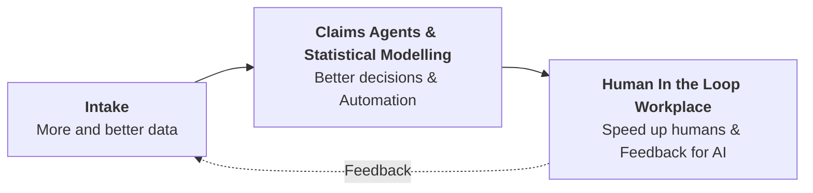

# QuantCo — Claim to Fame

> Konvertierte Fassung der Präsentation [`quantco-claim-to-fame-slides.pdf`](quantco-claim-to-fame-slides.pdf) (6 Folien, Titel im PDF: "Hackathon presentation").

---

## 1. Titel

**QuantCo — Claim to Fame Challenge**

*(Titelfolie, schwarzer Hintergrund, mit Wasserhahn-Maskottchen am Laptop.)*

---

## 2. We aim to solve P&C Claims with AI.



Darunter liegt quer über alle drei Blöcke die **Enablement & Integration Layer**.

### Why do we care about P&C Claims

- Retail insurance payout in Germany alone: **> 55 Billion a year**
- Natural catastrophes are becoming more frequent
- A lot of Claim Handlers will retire and not many young people choose this vocation
- …

---

## 3. What happens in PnC claims processing – oversimplified

| Claim Data Intake | Claim Assessment | Claim Settlement |
| --- | --- | --- |
| - Telephone, Documents.. <br> - First Notice of Loss <br> - Follow up questions | - Plausibility & coverage check <br> - Fraud & recourse detection <br> - Cost estimation… | - Send experts <br> - Check invoices <br> - Make payments |

### What's special?

- Much unstructured data
- Claim can be open for a while → much data
- Live decision making
- Huge diversity of what can happen in a claim
- Little automation
- PnC Insurers exist around the world

---

## 4. Claim to Fame: Price sharp, Detect fraud.

### Your Roles

| 🧾 **Issuer** | 🔍 **Insurance** |
| --- | --- |
| Set your charge **a** | Set your acceptance limit **b** |
| *How high can you price without crossing **t**?* | *How low can you go without rejecting fair claims?* |
| → **maximize revenue** | → **minimize payout** |

Beide Rollen spielen gegen denselben verborgenen Schwellenwert:

```
maximize revenue                hidden fair value (t)                minimize payout
|─────────────── fair ───────────────┊─────────────── fraud ───────────────|
```

Alles links von **t** gilt als *fair*, alles rechts davon als *fraud*. **t** ist den Teams nicht bekannt.

### You Face Every Other Team in Rounds

- New case released every **10 minutes**
- **1 min.** to analyze the case and submit charge price and acceptance limit
- You check other team's prices, they check yours

> More details can be found on our handout!

---

## 5. The Game – Summarized

### Data in each round

- **Damage description**, z. B.: *"The water pipe in the living room broke, resulting in a …."*
- `policy.txt`
- Optional photo
- Eine **Invoice** (Beispiel aus der Folie):

  | | |
  | --- | --- |
  | Invoice No. | 2026-0028 |
  | Date | 07 Aug 2026 |
  | Due date | 14 Aug 2026 |
  | Trade | Flooring |
  | From | StolperFrei Bodenverlegung GmbH, Laminatweg 19, 3800 Klicksburg |
  | To | European Hackathon, Hauptstraße 1, 8000 Munich |

  **Line items**

  | Pos. | Description | Qty | Unit | Unit price | VAT | Total |
  | ---: | --- | ---: | --- | ---: | ---: | ---: |
  | 1 | Remove water-damaged laminate in living room | 18 | m² | — | — | — |
  | 2 | New installation of laminate incl. impact sound insulation | 18 | m² | — | — | — |
  | 3 | Replace skirting boards | 25 | lm | — | — | — |
  | | **Net** | | | | | — |
  | | **plus VAT** | | | | | — |
  | | **Total amount** | | | | | — |

  > Wichtig: **Unit price, VAT und Total sind auf der Folie leer** — ebenso Net / plus VAT / Total amount.
  > Geliefert werden nur Position, Beschreibung, Menge und Einheit; die Preise sind genau das, was das Team bestimmen muss.

→ **1 min** Zeit zur Analyse, dann Abgabe von:

- **Charge price (a):** The amount you charge opposing teams
- **Acceptance limit (b):** The maximum amount your team is willing to accept and pay when receiving the same line item from another team

> **If you decline & your acceptance limit is below expert accepted prices → payout + penalty!**

---

## 6. Preis

**The Winning Team gets** (in addition to regular Hackathon price):

**Per Person: 1x AirPods Pro 3 + 100 € Coding Agent credit**

> Your methodology also counts (style)!

### Leaderboard (Beispiel-Screenshot aus den Folien)

| Rank | Team | Income | Costs | Net |
| ---: | --- | ---: | ---: | ---: |
| 1 | Ingenious Inigo | 7087.50 | 802.24 | **6285.26** |
| 2 | Hammer Hannes | 3737.10 | 2058.75 | **1678.35** |
| 3 | Babo Bernhard | 0.00 | 2749.92 | **-2749.92** |
| 4 | Turbo Tim | 0.00 | 3247.38 | **-3247.38** |
| 5 | Fire Florian | 0.00 | 3247.38 | **-3247.38** |
| 6 | Magic Marlene | 0.00 | 3247.38 | **-3247.38** |

Das Leaderboard hat die Tabs: Standings · Performance · Games · Matchup · Transactions · All Games.
